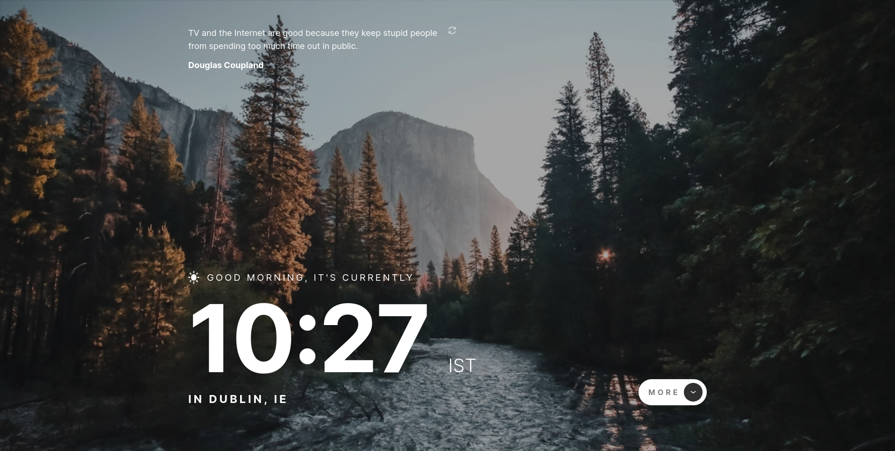
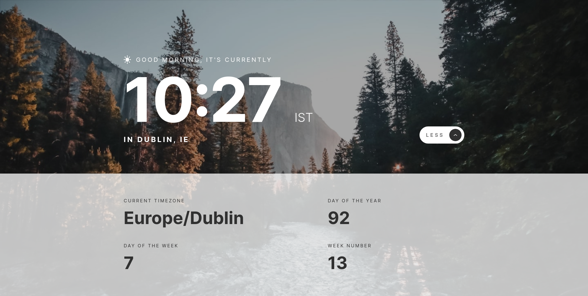

# Frontend Mentor - Clock app solution

This is a solution to the [Clock app challenge on Frontend Mentor](https://www.frontendmentor.io/challenges/clock-app-LMFaxFwrM). Frontend Mentor challenges help you improve your coding skills by building realistic projects.

## Table of contents

- [Overview](#overview)
  - [The challenge](#the-challenge)
  - [Screenshot](#screenshot)
  - [Links](#links)
- [My process](#my-process)
  - [Built with](#built-with)
  - [What I learned](#what-i-learned)
  - [Continued development](#continued-development)
  - [Useful resources](#useful-resources)
- [Author](#author)

## Overview

### The challenge

Users should be able to:

- View the optimal layout for the site depending on their device's screen size
- See hover states for all interactive elements on the page
- View the current time and location information based on their IP address
- View additional information about the date and time in the expanded state
- Be shown the correct greeting and background image based on the time of day they're visiting the site
- Generate random programming quotes by clicking the refresh icon near the quote

### Screenshot




### Links

- Solution URL: [URL](https://www.frontendmentor.io/solutions/clock-app-jCFp67oBjB)
- Live Site URL: [URL](https://lisviks.github.io/clock-app-frontendmentor/)

## My process

### Built with

- Semantic HTML5 markup
- Flexbox
- CSS Grid
- Mobile-first workflow
- Typescript
- SASS
- Vite build tool

### What I learned

How to add an animation to a button when clicked. To learn more about check [Useful resources](#useful-resources)

```scss
.refresh-quote-btn {
  transition: 0.5s;

  &:active {
    transition: 0s;
    transform: rotate(-360deg);
  }
}
```

### Continued development

Goign to use `typescript` for all future projects or at least for FrontEndMentor challenges, because I been wanting to learn it for a while now. Though didn't really use much of `typescript` specific things in this project. Mostly it was just plain javascript inside `typescript` file.

Another thing one to improve is my skills in `sass`. For now I know only a couple things about it, but there is a lot more to it than that.

Also `vite` build tool. It was very easy to get started with it and adding `sass` to it was as simple as running `yarn add -D sass` and that's it.

### Useful resources

- [Animate Buttons](https://www.w3schools.com/howto/howto_css_animate_buttons.asp) - Helped me to add a spinning animation to refresh quote button when clicked.

## Author

- Website - [Deividas Rimkus](https://deividas.blog)
- Frontend Mentor - [@Lisviks](https://www.frontendmentor.io/profile/Lisviks)
- Twitter - [@DRimkusDev](https://www.twitter.com/DRimkusDev)
- GitHub - [Lisviks](https://github.com/Lisviks)
